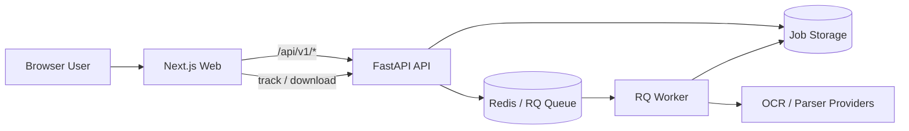
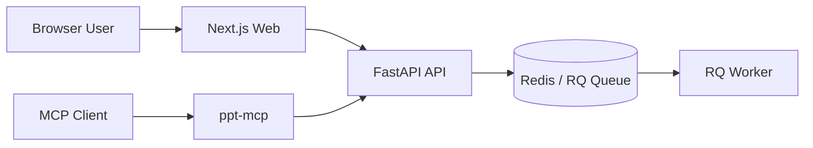

# Architecture

## Workflow

1. Upload a PDF and submit conversion parameters
2. The API creates a `job_id`, stores metadata, and queues the job
3. The worker performs parsing, OCR, image-region detection, and page reconstruction
4. The system exports `output.pptx`, and the client downloads it after status tracking

## Architecture Overview



## MCP in the Overall System

In addition to the browser flow, the current system can also be exposed to MCP clients through `ppt-mcp`.



The responsibility split is:

- the main `PDF2PPT` service handles parsing, OCR, job orchestration, and PPT generation
- `ppt-mcp` does not reimplement conversion logic; it wraps the existing API as MCP tools
- browser users normally go through the Web UI, while AI clients normally go through `ppt-mcp`

## Key Concepts

| Concept | Meaning | Typical options |
| --- | --- | --- |
| Parse Engine | Main document-processing pipeline | `local_ocr` `remote_ocr` `baidu_doc` `mineru_cloud` |
| OCR Provider | OCR / page-understanding backend | `aiocr` `tesseract` `paddle_local` `baidu` |
| AIOCR Chain | Remote vision-recognition mode | `direct` `layout_block` `doc_parser` |
| Scanned Page Mode | Export strategy for scanned pages | `fullpage` `segmented` |

## Job Directory and Artifacts

Typical job directory:

```text
api/data/jobs/<job_id>/
├── input.pdf
├── ir.parsed.json
├── ir.ocr.json
├── ir.json
├── output.pptx
└── artifacts/
    ├── ocr/
    ├── image_regions/
    ├── page_renders/
    ├── image_crops/
    └── final_preview/
```

By default:

- jobs and directories are retained for `24` hours
- they are then removed by the cleanup daemon
- if debug artifacts are disabled, the system keeps only the necessary result files where possible
