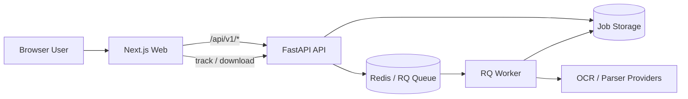
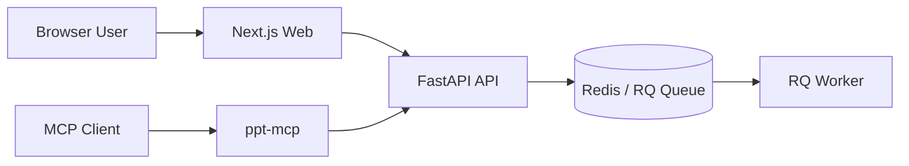

# 架构说明

## 工作流程

1. 上传 PDF 并提交转换参数
2. API 创建 `job_id`，写入任务元数据并将任务放入队列
3. Worker 进行 PDF 解析、OCR、图片区域识别与页面重建
4. 导出 `output.pptx`，前端或客户端按任务状态下载结果

## 架构概览



## 整体体系中的 MCP

除了 Web 用户链路之外，当前体系还可以通过 `ppt-mcp` 暴露给 MCP 客户端。



这里的职责边界是：

- `PDF2PPT` 主服务负责 PDF 解析、OCR、任务调度和 PPT 生成
- `ppt-mcp` 不重新实现转换逻辑，只把现有 API 包装成 MCP tools
- 浏览器用户通常走 Web 页面，AI 客户端通常走 `ppt-mcp`

## 关键概念

| 概念 | 说明 | 典型选项 |
| --- | --- | --- |
| Parse Engine | 文档主处理链路 | `local_ocr` `remote_ocr` `baidu_doc` `mineru_cloud` |
| OCR Provider | 识字与页面理解能力来源 | `aiocr` `tesseract` `paddle_local` `baidu` |
| AIOCR Chain | 远程视觉识别模式 | `direct` `layout_block` `doc_parser` |
| Scanned Page Mode | 扫描页导出策略 | `fullpage` `segmented` |

## 任务目录与产物

典型任务目录如下：

```text
api/data/jobs/<job_id>/
├── input.pdf
├── ir.parsed.json
├── ir.ocr.json
├── ir.json
├── output.pptx
└── artifacts/
    ├── ocr/
    ├── image_regions/
    ├── page_renders/
    ├── image_crops/
    └── final_preview/
```

默认情况下：

- 任务与目录保留 `24` 小时
- 之后由后台清理线程自动删除
- 如果关闭调试产物导出，会尽量只保留必要结果文件
